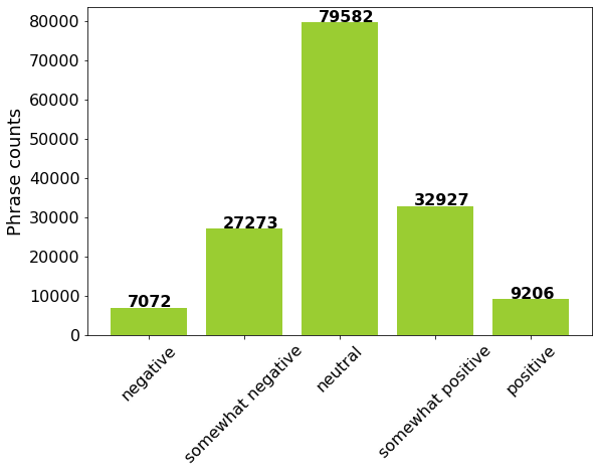
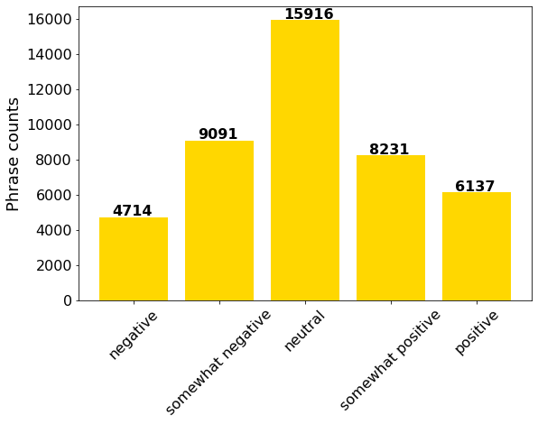

# Classify-the-sentiment-of-movie-reviews
## Introduction
  Sentiment is a thought, opinion, or idea based on a feeling about a situation, or a way of thinking about something. Sentiment classification is a challenging classification task, which uses natural language processing, text analysis, computational linguistics, and biometrics to identify opinions and emotions in text and assign proper sentimental labels (such as positive, negative, or neutral) to them. Sentiment classification has been widely used in business and product development settings to understand how customers feel about products, services, or brand. The objective of this project is to conduct sentiment classification on the Rotten Tomatoes dataset using a variety of classifiers and evaluate/compare the prediction results. 
## Dataset
  The Rotten Tomatoes movie review dataset (accessible at: https://www.kaggle.com/c/sentiment-analysis-on-movie-reviews) contains a corpus of movie reviews used for sentiment analysis, which is originally collected by Pang and Lee (2006). Later, Socher et al. (2013) created fine-grained labels for all parsed phrases in the corpus using Amazon's Mechanical Turk. As a result, the text in Rotten Tomatoes dataset is not complete sentences but parsed short phrases. The dataset includes a total of 156,060 training data and 66,292 testing data. The training set has 4 columns: PhraseId, SentenceId, Phrase, and Sentiment, while the test set has the first three but no Sentiment. The first ten training samples are shown in Table 1. The length of each phrase varies, and some phrase may just contain one stop word (e.g., phrase 4 and 7) or one punctuation. However, the same stop word may have very different labels, leading to a certain challenge in this data set.
  The training data are classified into 5 classes, which are 0-negative, 1-somewhat negative, 2-neutral, 3-somewhat positive, 4-positive. There is a natural order among the different classes. Such ordering information can be used during the classification task. Notably, neutral is the dominant class whose number of data points is over 10 times than the number of data points from the most minor class (negative; Figure 1). 
  
  
## Methods
### Sentence and text embedding
  Recent studies have demonstrated strong transfer task performance using pre-trained sentence level embeddings (Conneau et al., 2017, Cer et al., 2018). The models take strings as input and produce an embedding representation of the string with a fixed dimension as output. The sentence level embeddings differ significantly from traditional bag of words approach in converting text information into numerical vectors to create features for machine learning classifiers. The bag of words approach simply counts how many times a word appears in a document and does not consider the relationship between different words within a sentence. However, sentence level embeddings such as Sentence Transformers make use of sophisticated Recurrent Neural Network (RNN) framework to learn text information at sentence level, which enables this approach to consider the text dependencies and connections. As a result, sentence level embeddings are normally preferred for complicated text classification such as sentiment classification. 
  The pre-trained embedding language models are publicly available in SentenceTransformers which is a Python framework for state-of-the-art sentence and text embeddings (www.SBERT.net). There are 26 models that were trained on SNLI and MultiNLI and then fine-tuned on the Semantic Textual Similarity (STS) benchmark train set. The ‘roberta-large-nli-stsb-mean-tokens’ model was used for this project as it has the highest STSb performance (86.39). We used GPU under Google Collaboratory to run the SentenceTransformers. The resulting training and test sets have dimension 156,060 × 1024 and 66292 × 1024, respectively.  
### Training set splitting
  Because the test data set has no sentiment labels and in order to better guide the downstream classification task, we decided to only use the training set to perform the classification. Additionally, the training dataset with a total of 156,060 phrases is too big to train classifiers within a reasonable time frame especially when the classifiers need parameter-tuning. As a result, we decided to subsample training data from each sentiment class to further reduce the size of the training set and simultaneously address the issue of unbalanced classes. As shown in Figure 1, the training set is class-imbalanced with negative class to positive class ratio as 1: 3.9 : 11.3 : 4.7 : 1.3. For each of the class, we randomly split train and test with a prefixed ratio to manually balance the five classes for training. Specifically, the proportions of training size in the five classes from negative, somewhat negative, neutral, somewhat positive, to positive are 2/3, 1/3, 1/5, 1/4, and 2/3 respectively. Thus, the resulting training set has 4714, 9091, 15916, 8231, and 6137 phrase counts for their corresponding class respectively (Figure 2). The largest class ratio is 3.4 (neutral versus negative) which is lower than 5, thus we regard the new training set as relatively “balanced”. For the test data set, we then have 2358, 18182, 63666, 24696, and 3069 phase counts for their corresponding class respectively. We then used the new training (44089 × 1024) and test sets (111971 × 1024) for the following classification task. 
  
### Ordinal classification
  Another import characteristic of our data set is the presence of a “natural” order among classes. Conventional classification methods for nominal classes could be applied to solve such ordinal problems, but the use of techniques designed specifically for ordered classes could potentially yield classification results with a better performance (Frank and Hall, 2001). Frank and Hall (2001) proposed a simple approach to conduct ordinal classification without any modification of the underlying learning algorithm. First the original training data needs to be transformed from a k-class ordinal problem to k-1 binary class problems, resulting in k-1 new binary data sets. Then classifiers which can produce class probability will be trained on each of the k-1 data sets. For class Ci (ordinal scenario 1), 
P(C_1 )=1-P(Y> C_1)
P(C_i )=P(Y>C_(i-1) )- P(Y> C_i),1<i<k
P(C_k )=P(Y> C_(k-1))
During prediction, a sample without class information is processed by each of the k-1 classifiers and the probability values of each of the k classes are calculated by the above approach. Probabilities of all classes are then compared and the class with the maximum probability is assigned to the test sample. It’s worth noting that this method may lead to negative estimates of probability values for Ci when 1 < i < k at the prediction time (Frank and Hall, 2001). Cardoso and Pinto da Costa (2007) proposed to use the following formula (ordinal scenario 2):
P(C_i )=(1-P(Y>C_i ))P(Y> C_(i-1)),1<i<k
Alternatively, as we learned from the class, we can also predict the test label based on the cumulative probabilities according to the following objective formula (ordinal scenario 3):
y ̂=min┬i⁡〖P(Y ≤C_i│x)>1/2,1 ≤i≤k〗
In this project, all three of the ordinal classification algorithms were implemented and the corresponding results were compared.
### Classification methods
  Multiple classification methods were applied, including Linear Discriminant Analysis (LDA), Quadratic Discriminant Analysis (QDA), Gaussian Naïve Bayes (GNB), Logistic Regression (LR), Support Vector Method (SVM), Random Forest (RF), and Neural Networks (NN), Convolution Neural Networks (CNN), and Recurrent Neural Networks (RNN). Two classification scenarios were processed, one is to treat the class attribute as a set of unordered values and apply each of the standard classification algorithms, second is to make use of the ordering information among classes by the technique described in section 3.3. For each of the classification scenario, we tuned the classifiers (if applicable) with a range of potential parameters (such as regularization, number of trees, number of neurons, etc.) and the best accuracy was reported in this report. 
  It is worth to mention that for CNN and RNN, there are other suggested embedding methods to convert text information to numerical vectors. Instead of using sentence transformer (as described in section 3.1), we used the default embedding method and word2vec for RNN and CNN respectively. We also padded the training data with 0s in the beginning to force all the data to have the same length of 50 and 100 for CNN and RNN respectively. We were not able to apply ordinal classification on CNN and RNN as the coded ordinal classification function was not compatible with the functions to conduct CNN and RNN. As a result, CNN and RNN were only trained under the standard classification scenario.
  The overall architecture design of CNN and RNN is crucial for their overall performance, but the design and tuning of those deep learning models are very challenging. For RNN model, we designed the first layer as the embedding layer, the second layer as the long short-term memory (LSTM) layer (a special kind of RNN, capable of learning long-term dependencies) with 100 neurons, the third layer as the drop-out layer with a drop-out rate of 0.5 (to alleviate over-fitting), and the final dense layer that produces the probability distribution of the 5 classes using “softmax” activation. For CNN model, we designed the first layer as the embedding layer, the second layer as the filter layer containing 5 different filters (sizes range from 2-6) with each filter followed by a GlobalMaxPooling1D layer (to down-sample the input representation by taking the maximum value over the time dimension), the third layer as the concatenating layer to join the outputs from the 5 filters, the fourth layer as the drop-out layer with a drop-out rate of 0.1, the fifth layer as the dense layer containing 128 neurons with “relu” activation, the sixth layer as another drop-out layer with a drop-out rate of 0.2, and the final dense layer that produces the probability distribution of the 5 classes using “sigmoid” activation.

